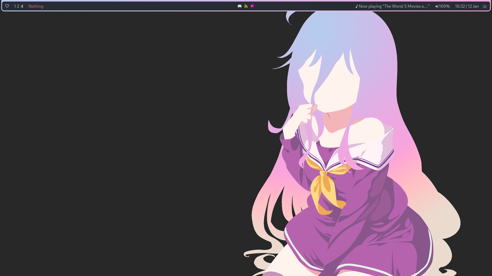
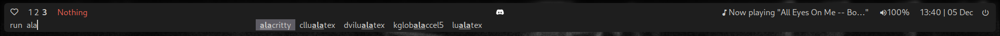
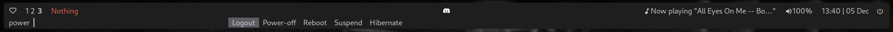

# 📁 Dotfiles

That's the files I used to customize my i3 WM.

## 📑 Summary

- [i3-gaps-rounded](https://github.com/jbenden/i3-gaps-rounded) – window manager
- [polybar](https://github.com/polybar/polybar) – status bar
- [wallpaper](./docs/wallpaper.png) – Koko from Betty Boop Snow White in high
  quality found
  [here](https://www.deviantart.com/nicolahynes/art/Fleischer-Studios-Koko-the-Clown-2K-Wallpaper-728097079)
- [neovim](https://github.com/neovim/neovim) +
  [CodeArt](https://github.com/artart222/CodeArt) or
  [vscodium](https://github.com/VSCodium/vscodium/) – text & code editor
- [dunst](https://github.com/dunst-project/dunst) – notification daemon
- [alacritty](https://github.com/alacritty/alacritty) – terminal emulator
- [rofi](https://github.com/joni22u/rofi) – app launcher, alt+tab window,
  powermenu
- [zsh](https://www.zsh.org/) + [oh-my-zsh](https://github.com/ohmyzsh/ohmyzsh)
  – shell
- [picom](https://github.com/yshui/picom) – X11 compositor (specifically
  `picom-git` for rounded corners)
- Fonts used:
  - `Cantarell`
  - `Material Icons`
  - `FontAwesome5Free`
  - `FontAwesome5Brands`
  - `IPAGothic`
  - `font-logos`

## ✍🏻 What _you_ have to change before using it

- `.config/i3/config` – auto run commands at the near end of the file

## ✨ Screenshots

    
Show all

    <h3>🖼️ Desktop</h3>
    
    <h3>📟 Rofi</h3>
    <ul>
        <li>
            <h6>Launcher</h6>
            
        </li>
        <li>
            <h6>Power menu</h6>
            
        </li>
        <li>
            <h6>Window changer</h6>
            
        </li>
    </ul>
    <h3>🗨️ Dunst notifications</h3>
    

        
    

## 📝 Licensing

This project is available under MIT License conditions.
